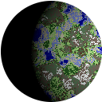

# Magrathea



> And thus were created the conditions for a staggering new form of specialist industry: custom-made luxury planet building. The home of this industry was the planet Magrathea, where hyperspatial engineers sucked matter through white holes in space to form it into dream planets—gold planets, platinum planets, soft rubber planets with lots of earthquakes—all lovingly made to meet the exacting standards that the Galaxy’s richest men naturally came to expect. _[From the Hitchhiker's Guide to the Galaxy](https://hitchhikers.fandom.com/wiki/Magrathea)_

Magrathea is a procedural planet generator, focused on generating pixel-art style planets. It is written in [Rust](https://rust-lang.org) and can be used either as a standalone executable or as a crate.

## Using from the command line

This will print the help output for the command:

`cargo run --features cli -h`

If you wish to also see commands relating to launching the GUI editor, pass the `editor` feature instead of `cli`:

`cargo run --features editor -h`

### Examples

#### Generate a random 128x128 pixel into `./planet.png`

`cargo run --features cli generate -o ./planet.png`

#### Run the editor with a new planet

`cargo run --features editor edit`

## Using as a crate

Add magrathea to your Cargo.toml:

`magrathea = "*"`

Create a 128x128 rendering of a random Planet:

```rust
let planet = magrathea::Planet {
    seed: Uuid::new_v4(),
    origin: Point2D::new(x_km, y_km),
    radius: Length::new(radius_km),
    colors: Coloring::earthlike(),
};
let image = planet.generate(128, &Light::defaulFt())
```

## License

Magrathea is licensed under the [MIT License](./LICENSE.txt).
